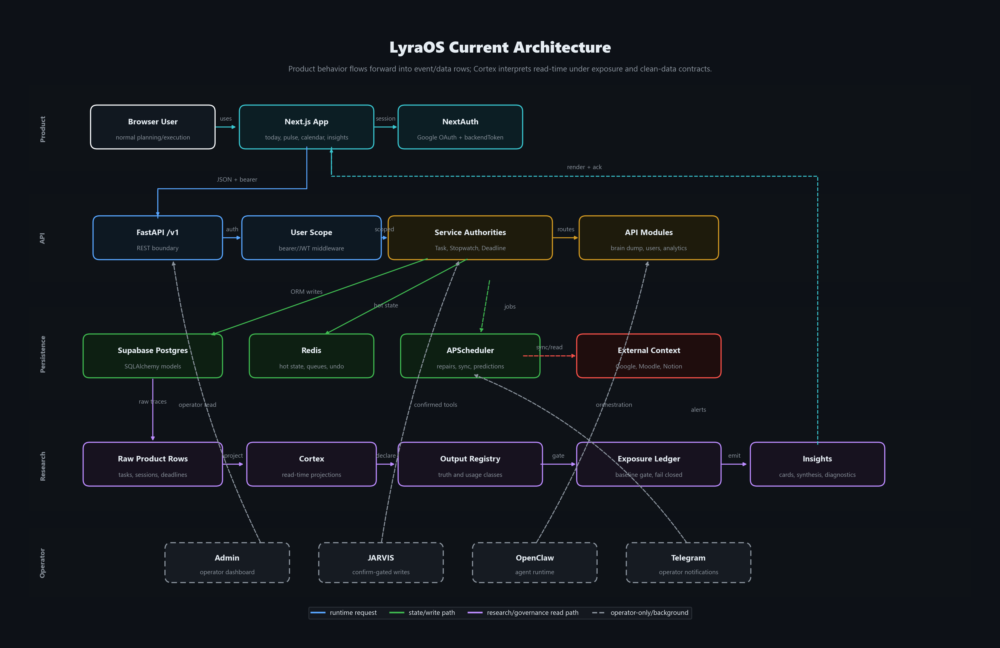
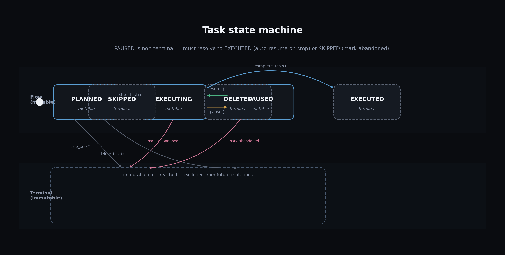
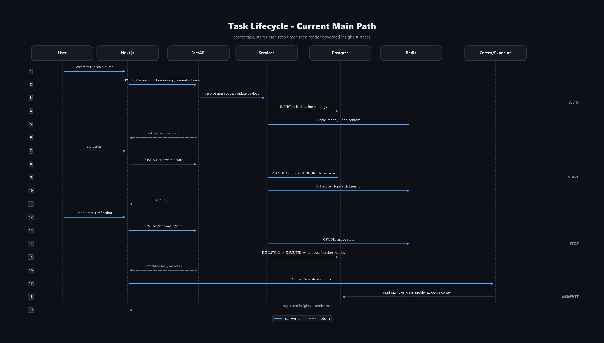

# Lyra Secretary v1.1

[](https://github.com/Holmesberg/lyra-secretary/actions/workflows/ci.yml)
[](LICENSE)
[](https://github.com/Holmesberg/lyra-secretary)

> Adaptive scheduling backend for a personal cognitive operating system

## What Is This?

Lyra Secretary is a FastAPI backend that manages your daily schedule by tracking **planned vs. executed task duration** — the **delta** — to learn behavioral patterns over time. Every task records how long you *said* it would take and how long it *actually* took, building a quantitative profile of your time usage.

The long-term vision: integrate with **LYRA BCI** (EEG-based cognitive state detection) to close the loop — the scheduler adapts not just to what you *did*, but to how you *felt* while doing it.

## Architecture

At a glance: **Telegram** → **OpenClaw** (AI agent) → **FastAPI** → **TaskManager** → **SQLite**, **Redis**, **Notion**; **APScheduler** runs in-process for reminders, timer overflow, and Notion retry. Details below.

## System Design

High-resolution diagrams (dark theme) live in [`docs/diagrams/`](docs/diagrams/); regenerate with `python docs/diagrams/generate_diagrams.py` after installing `matplotlib`. Index: [`docs/README.md`](docs/README.md).

### System architecture



### Task state machine

States and transitions match `StateMachine.TRANSITIONS` in [`backend/app/services/state_machine.py`](backend/app/services/state_machine.py); methods are on `TaskManager` (see [`backend/app/services/task_manager.py`](backend/app/services/task_manager.py)).



### Task lifecycle (data flow)

Create → `POST /v1/create` → start stopwatch → `POST /v1/stopwatch/start` → stop → `POST /v1/stopwatch/stop` → Notion `sync_task()` on success paths. Routes are mounted in [`backend/app/api/v1/router.py`](backend/app/api/v1/router.py).



## Tech Stack

| Layer       | Technology                          |
|-------------|-------------------------------------|
| API         | Python 3.11, FastAPI, Uvicorn       |
| ORM         | SQLAlchemy 2.0, Alembic             |
| Cache       | Redis 7                             |
| Database    | SQLite                              |
| Sync        | Notion API                          |
| AI Agent    | OpenClaw                            |
| Container   | Docker, Docker Compose              |

## Prerequisites

- **Docker Desktop** (with Compose V2)
- **OpenClaw** installed separately — [github.com/openclaw/openclaw](https://github.com/openclaw/openclaw)

## Setup

### 1. Clone

```bash
git clone https://github.com/Holmesberg/lyra-secretary.git
cd lyra-secretary
```

### 2. Configure environment

```bash
cp .env.example .env
```

Fill in the required keys in `.env`:

| Key                  | Required | Where to get it                                          |
|----------------------|----------|----------------------------------------------------------|
| `NOTION_API_KEY`     | Yes      | [notion.so/my-integrations](https://notion.so/my-integrations) |
| `NOTION_DATABASE_ID` | Yes      | Copy from Notion database URL                            |
| `ANTHROPIC_API_KEY`  | Yes      | [console.anthropic.com](https://console.anthropic.com)   |
| `USER_TIMEZONE`      | Yes      | IANA timezone, e.g. `Africa/Cairo`                       |

### 3. Start services

```bash
docker-compose up -d --build
```

### 4. Run database migrations

```bash
docker-compose exec backend alembic upgrade head
```

### 5. Seed initial data (optional)

```bash
docker-compose exec backend python app/db/seed.py
```

### 6. Verify

```bash
curl http://localhost:8000/v1/health
# → {"status":"ok","service":"lyra-secretary"}
```

### 7. Explore the API

Open **Swagger UI**: [http://localhost:8000/docs](http://localhost:8000/docs)

## OpenClaw Integration

OpenClaw runs as a **separate Docker stack**. To connect it to the Lyra backend:

1. **Connect to the Lyra network:**
   ```bash
   docker network connect lyrasecretaryv01_default <openclaw-container-name>
   ```
   Or add `lyrasecretaryv01_default` as an external network in OpenClaw's `docker-compose.yml`. See [DOCKER.md](DOCKER.md) for details.

2. **Install the skill:**
   Copy `openclaw/skills/lyra-secretary/SKILL.md` into your OpenClaw skills directory:
   ```bash
   cp -r openclaw/skills/lyra-secretary ~/.openclaw/skills/
   ```

3. **Verify connectivity:**
   ```bash
   docker exec <openclaw-container> curl -s http://backend:8000/v1/health
   # → {"status":"ok","service":"lyra-secretary"}
   ```

4. OpenClaw reaches the FastAPI backend at `http://backend:8000` (Docker service DNS).

## API Endpoints

All endpoints are under `/v1/`. Stopwatch routes are mounted with prefix `/stopwatch` (see [`backend/app/api/v1/router.py`](backend/app/api/v1/router.py)).

| Method | Endpoint | Description |
|--------|----------|-------------|
| POST | `/v1/parse` | Parse natural language → structured task |
| POST | `/v1/create` | Create a task |
| POST | `/v1/reschedule` | Reschedule an existing task |
| POST | `/v1/delete` | Soft-delete a task |
| POST | `/v1/stopwatch/start` | Start stopwatch for a task (or ad-hoc title) |
| POST | `/v1/stopwatch/stop` | Stop active stopwatch (`?confirmed=true` if early stop) |
| GET | `/v1/stopwatch/status` | Get stopwatch status |
| GET | `/v1/health` | Health check |
| GET | `/v1/tasks/query` | Query tasks by date, category, state |
| GET | `/v1/tasks/{task_id}` | Fetch single task with full detail |
| POST | `/v1/undo` | Undo last create or delete (30s window) |
| POST | `/v1/notifications/push` | Push notification to queue |
| GET | `/v1/notifications/pending` | Poll and drain notification queue |

Full request/response schemas are documented in [`openclaw/skills/lyra-secretary/SKILL.md`](openclaw/skills/lyra-secretary/SKILL.md) and in Swagger UI at `/docs`.

## Current Status

**Core pipeline**
- ✅ Natural language parsing → structured task data
- ✅ Create / reschedule / delete tasks with conflict detection
- ✅ State machine: `PLANNED → EXECUTING → EXECUTED / SKIPPED / DELETED`
- ✅ Immutable history — executed tasks are permanent records
- ✅ 30-second undo window (`POST /v1/undo`)

**Stopwatch**
- ✅ Planned vs. actual duration tracking (delta)
- ✅ Early-stop gate — backend requires explicit confirmation if stopped before 50% of planned duration
- ✅ Future task warning — warns before starting timer for a task not yet scheduled
- ✅ Redis desync recovery — auto-restores active session from SQLite on restart

**API**
- ✅ `GET /v1/tasks/{task_id}` — single task fetch with full detail
- ✅ `GET /v1/tasks/query` — query by date, category, state
- ✅ `POST /v1/undo` — 30-second undo window via Redis TTL
- ✅ `POST /v1/notifications/push` + `GET /v1/notifications/pending` — notification queue

**Background workers (APScheduler)**
- ✅ Pre-task reminders — 15-minute warning, polls every 1 minute
- ✅ Timer overflow notification — alerts when session exceeds planned duration + 5 min
- ✅ Notion sync retry queue — failed syncs retried every 5 minutes

**Integrations**
- ✅ Notion calendar sync — create, update, archive pages
- ✅ OpenClaw integration via Docker network bridge
- ✅ Idempotency keys — deduplication via Redis (30s TTL)
- ✅ Notification polling — backend pushes, OpenClaw polls every 30s

**Agent behavior (SKILL.md)**
- ✅ Hard Rule #1 — never auto-force conflicts
- ✅ Hard Rule #2 — bulk delete requires confirmation
- ✅ Hard Rule #3 — never use generic task names
- ✅ Hard Rule #4 — always report times from API response
- ✅ Hard Rule #5 — early-stop gate enforced at backend + skill level
- ✅ Hard Rule #6 — verify task state via backend before any mutation

## Roadmap

- [ ] OpenClaw tool schema (structured tool definitions)
- [ ] BCI cognitive session logging (EEG state during tasks)
- [ ] Weekly/monthly analytics and pattern reports

## Contributing

See [CONTRIBUTING.md](CONTRIBUTING.md).

## License

This project is licensed under the [MIT License](LICENSE).
