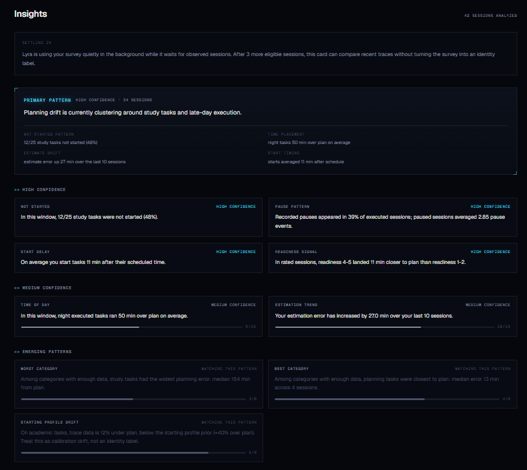
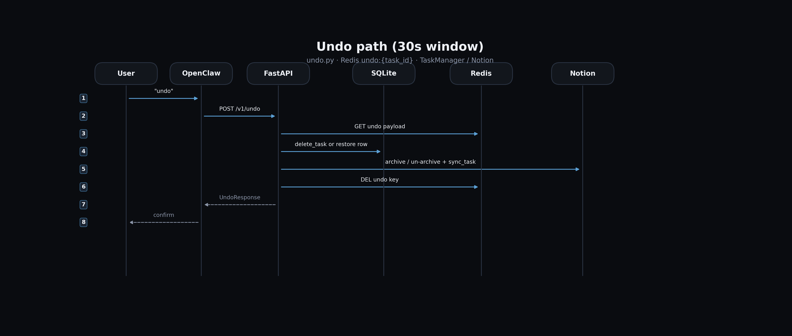

# LyraOS

People do not see how obligations, time, and actual execution are interacting
until pressure has already compounded into failure or recovery mode.

Lyra helps humans build more accurate internal models of their own execution
dynamics without collapsing into shame, dependence, or optimization theater.

[](https://github.com/Holmesberg/lyra-secretary/actions/workflows/ci.yml)
[](LICENSE)
[](https://github.com/Holmesberg/lyra-secretary)

> An execution-reality layer for seeing where plans actually break.



LyraOS is an execution-reality middleware layer wrapped in a product interface.
Calendars, LMSs, task apps, and planning tools already hold commitments;
LyraOS interprets what happens when those commitments collide with real
execution. Users can still plan tasks, run timers, recover from missed plans,
and inspect patterns in their own traces. Underneath, every plan is treated as
a hypothesis, every work session as evidence, and every behavioral claim as
something that must earn authority through provenance, clean-data rules,
exposure state, and uncertainty.

It is not an AI productivity wrapper. The interesting core is explicit,
rule-governed, probabilistic, longitudinal, and inspectable.

```text
observe -> canonicalize -> gate by provenance/exposure -> synthesize cautiously
```

Current methods-paper direction:

```text
Measurement Integrity Before Agency Claims
```

LyraOS should not jump from events or metrics directly to claims about focus,
motivation, avoidance, discipline, recovery, agency, or improvement. The
research direction is documented in
[`docs/measurement_integrity_before_agency_claims.md`](docs/measurement_integrity_before_agency_claims.md).

## Why This Exists

People often plan sincerely and still fail themselves. LyraOS asks whether that
failure is just noise, or whether planning error has structure that can be
observed, modeled, and reflected back without turning the mirror into judgment,
identity labeling, or black-box intervention.

The current answer is a conservative system: capture normal planning and timer
behavior, preserve the trace, separate observation from inference, and surface
only bounded, time-local hypotheses.

The alignment claim is honesty, not obedience. LyraOS should help users
preserve contact between intention, constraint, action, and consequence without
optimizing them into hidden compliance, dependence, or engagement loops.

The broader invariant is trajectory integrity: repeated human-system
interactions shape what people do next. LyraOS treats technology as an
amplifier, not an enemy, and constrains that amplification so reality contact
does not collapse into hidden proxy optimization.

## Current Status

LyraOS is pre-alpha dogfood with the operator plus a small alpha cohort.

| Surface | Status |
| --- | --- |
| Public frontend | `https://lyraos.org` |
| Public API | `https://api.lyraos.org` |
| Product maturity | Pre-alpha, actively dogfooded |
| Research posture | Product research substrate, not IRB-approved study |
| Adaptive scheduling | Future-gated, not autonomous |
| Calendar mutation | Not shipped |

The repository contains the product app, backend API, public topology checks,
research/governance contracts, operator-only tooling, diagrams, and historical
design notes.

## What Makes It Different

Most productivity systems respond to uncertainty by asking the user more
questions or by hiding inference inside vague personalization. LyraOS tries a
different strategy:

- sit above existing planning systems instead of replacing them
- keep the minimum useful loop lightweight
- treat user attention as scarce scientific capital
- use repeated behavior, timing, pauses, missingness, recovery, and context as
  weak signals
- treat influence as inevitable but unconscious influence as unacceptable
- avoid stable identity labels
- let cold-start priors decay as personal traces accumulate
- fail closed when exposure or provenance state is unknown
- keep user-facing claims descriptive unless stronger evidence is explicitly
  authorized

That makes the system closer to HCI instrumentation, adaptive behavioral
systems, and longitudinal measurement tooling than to generic AI SaaS.

## The Minimum User Loop

The core product loop is intentionally small:

```text
sign in -> consent -> dump/create tasks -> start/stop timers -> recover or reflect
```

Additional inputs exist, but they are embedded at natural workflow boundaries:

| Input stream | Burden | Purpose |
| --- | --- | --- |
| Task title, time, duration, category | Required for planning | User's explicit plan |
| Brain dump | Optional/onboarding | Low-friction task/deadline capture |
| Timer start/stop/pause/resume | Required for execution | Behavioral trace |
| Readiness | In-flow when shown | Pre-task self-report |
| Reflection/completion | In-flow when shown | Post-task self-report |
| Pause reason | In-flow when shown | Pause-process context |
| Recovery actions | User initiated | Product repair, not baseline execution |
| Archetype survey | Skippable | Cold-start prior, not identity truth |
| Feedback/bug reports | Optional | Alpha product quality |

LyraOS gets most of its value from longitudinal repetition and trace topology,
not from heavy questionnaires.

## Shipped Product

User-facing surfaces:

- Google sign-in through NextAuth
- brain-dump onboarding
- task planning and quick capture
- timer execution: start, pause, resume, stop, switch
- overdue and missed-plan recovery
- calendar and deadline views
- Moodle iCal import and submission detection
- read-only Google Calendar context
- Pulse dashboard
- Insights page with primary synthesis and confidence-tiered cards
- pause and resume prediction surfaces
- archetype survey/proximity, framed as cold-start priors
- settings, account export/deletion, and feedback

Operator-only surfaces:

- admin dashboard
- JARVIS
- OpenClaw workflows
- operator notifications
- topology verification
- exposure diagnostics and policy logs
- Notion outbound sync/retry plumbing

## Not Shipped

These are intentionally not public product behavior:

- autonomous rescheduling
- hidden calendar mutation
- validated adaptive scheduling
- confidence-backed behavioral recommendations
- stable user identity labels
- AI-generated truth about behavior
- learning from exposed/intervened behavior without exposure modeling
- new required research inputs without a successor contract

## Architecture

```text
Next.js web app
  -> NextAuth Google identity
  -> frontend backendToken JWT
  -> FastAPI v1 API
  -> request user scope middleware
  -> service-layer mutation authorities
  -> SQLAlchemy models / Supabase Postgres
  -> Redis hot state and queues
  -> APScheduler workers

Research/governance layer:
  raw product events and rows
  -> Cortex read-time projections
  -> clean-data profiles
  -> output surface registry
  -> exposure ledger and render acknowledgement
  -> insights, diagnostics, predictions, and policy audits

Operator-only layer:
  JARVIS
  OpenClaw
  admin diagnostics
  operator notifications
```

Runtime topology is part of correctness. Browser smoke is not trusted until
frontend origin, API origin, auth base URL, CORS, and runtime topology agree.

Current public topology:

```text
frontend: https://lyraos.org
api:      https://api.lyraos.org
auth:     https://lyraos.org
```

Verify topology:

```bash
node scripts/verify_runtime_topology.mjs --topology public
```

Production frontend recovery is WSL/public-topology specific:

```powershell
powershell -ExecutionPolicy Bypass -File scripts/restart_frontend_wsl.ps1
```

Do not prove `lyraos.org` by starting a separate Windows `next start` process.
See `docs/incidents/2026-05-17-public-frontend-mixed-topology.md`.

## System Diagrams

Diagrams live in [docs/diagrams](docs/diagrams). Regenerate them with:

```bash
python docs/diagrams/generate_diagrams.py
```

### System Architecture


### Task State Machine


### Task Lifecycle


### Undo Path



## Measurement Model

Cortex is the read-time canonicalization layer. It does not silently rewrite
product state.

Core variables:

| Symbol | Name | Meaning |
| --- | --- | --- |
| `P` | planned active minutes | The user's plan |
| `E` | executed active minutes | Active work excluding pauses |
| `W` | wall-clock elapsed minutes | Real elapsed time |
| `B` | paused minutes | Total pause duration |
| `m` | execution multiplier | `E / P` |
| `z` | log execution multiplier | `log(E / P)` |

Important measurement rules:

- observed facts, derived metrics, and latent hypotheses stay separate
- derived metrics are recomputed at read time
- unknowns never become neutral defaults
- retroactive/repaired rows do not become measured execution by accident
- exposed or unknown-exposure rows do not silently update clean learning paths
- behavior-shaping outputs must be registered before render

## Adaptive Direction

Adaptive scheduling is a research direction, not a shipped autonomous planner.

The intended loop:

```text
observe
  -> synthesize
  -> suggest a small experiment
  -> measure the result
  -> adapt confidence
```

Stronger guidance should appear only when enough clean, longitudinal evidence
exists for a specific user and context. Current public behavior stops at
descriptive insights, bounded synthesis, and conservative prediction surfaces.

## Technology Stack

| Layer | Current stack |
| --- | --- |
| Frontend | Next.js 15.5.15, React 18, TypeScript 5.6 |
| Styling/UI | Tailwind CSS, Radix, Lucide, Tremor, Schedule-X, Sonner, Motion |
| Auth | NextAuth.js 4 with Google OAuth |
| Backend | FastAPI 0.109, Uvicorn, Python |
| ORM/migrations | SQLAlchemy 2 typed models, Alembic |
| Database | Supabase Postgres in public runtime; SQLite for dev/tests |
| Hot state | Redis |
| Workers | APScheduler |
| Operator tooling | JARVIS and OpenClaw, operator-only |

## Local Development

Prerequisites:

- Docker Desktop with Compose V2
- Node.js for the frontend
- Python environment matching backend requirements

Configure environment:

```bash
cp .env.example .env
```

Start backend dependencies and API:

```bash
docker compose up -d --build
docker compose exec backend alembic upgrade head
```

Run the frontend locally:

```bash
cd frontend
npm install
npm run dev
```

Local URLs:

- Frontend: `http://localhost:3000`
- Backend health: `http://localhost:8000/v1/health`
- Swagger UI: `http://localhost:8000/docs`

Local topology verification:

```bash
node scripts/verify_runtime_topology.mjs --topology local
```

## API Shape

All backend routes are mounted under `/v1`.

| Module | Responsibility |
| --- | --- |
| `health.py` | health, environment invariants, topology report |
| `users.py` | `/users/me`, consent, onboarding stamps, export/deletion |
| `tasks.py` | task CRUD, state transitions, recovery, LLM binding actions |
| `stopwatch.py` | start, pause, resume, stop, switch, status |
| `query.py` | range task queries and last-task lookup |
| `brain_dump.py` | brain-dump parse and commit |
| `deadlines.py` | deadline CRUD and state transitions |
| `calendar.py` | Google Calendar read-only events and outcomes |
| `moodle.py` | Moodle iCal and Web Services integration |
| `analytics.py` | insights, Cortex diagnostics, bias/prediction endpoints |
| `exposures.py` | render acknowledgement and exposure utilities |
| `jarvis.py` | operator-only JARVIS chat/confirm/health/stream |
| `admin.py` | operator-only dashboard |

## Governance Map

| File | Role |
| --- | --- |
| [MANIFESTO.md](MANIFESTO.md) | Top-level doctrine and pre-registration artifact |
| [docs/external_review_quickstart.md](docs/external_review_quickstart.md) | One-page reviewer orientation |
| [docs/professor_review_packet.md](docs/professor_review_packet.md) | External-review orientation |
| [docs/behavioral_instrumentation_doctrine.md](docs/behavioral_instrumentation_doctrine.md) | Rule/probabilistic instrumentation doctrine |
| [docs/cortex_contract_v0.md](docs/cortex_contract_v0.md) | Canonical metrics and clean-data profiles |
| [docs/cortex_product_research_contract_v0.md](docs/cortex_product_research_contract_v0.md) | Product/research boundary and exposure ledger doctrine |
| [docs/adaptive_scheduling_progressive_inference.md](docs/adaptive_scheduling_progressive_inference.md) | Future-gated adaptive scheduling contract |
| [docs/deployment_architecture.md](docs/deployment_architecture.md) | Public topology and operational deployment |
| [docs/openclaw_orchestration_contract_v0.md](docs/openclaw_orchestration_contract_v0.md) | Operator-only OpenClaw boundary |
| [archive/appstore/summary_of_app.md](archive/appstore/summary_of_app.md) | Historical product and architecture lineage; not current governance unless promoted |

## Privacy And Security Notes

LyraOS is pre-alpha product research and operator dogfood with a small alpha
cohort. Unless a separate institutional protocol is approved, it should not be
represented as an IRB-approved human-subjects study.

Known current security/privacy debts:

- Google refresh tokens are plaintext security debt.
- Moodle iCal URLs are plaintext security debt.
- Public privacy/terms copy has been improved from placeholders but still needs
  production-grade legal review before broader release.
- Cloudflare Tunnel from the operator host remains an operational dependency.

## Historical Notes

Some files preserve older names such as "Lyra Secretary," earlier architecture
designs, prototype operator-tooling assumptions, and pre-alpha bug trackers.
Treat those as lineage unless current governance docs explicitly promote them.

The root bug tracker has been archived at
[archive/LYRA_BUGS.md](archive/LYRA_BUGS.md).
Active user-reported bugs are triaged through the
[24h admin bug sweep](docs/feedback_triage_recipe.md) and tracked in GitHub
Issues.

Local operator vaults, assistant-runtime state, and local-only working files are
ignored or removed from tracked repository state. The `notebooks/` directory
remains tracked for shareable templates and reproducible analysis scaffolding.

## License

This project is licensed under the [MIT License](LICENSE).
